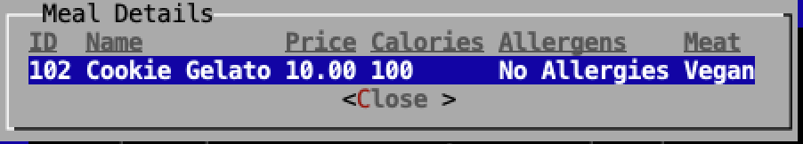
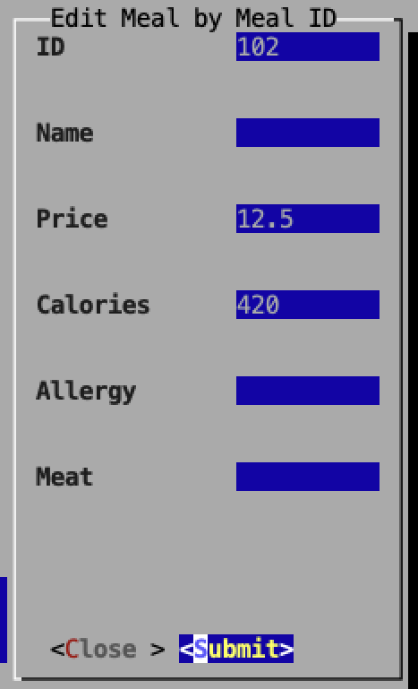

#### Xudong Zhang, Christian Stehle, Valentin Straßer, Michał Roziel

---

## 1. Projektübersicht

### Cantine Planner - Projekt in Programmierung 3

Cantine Planner ist ein Programm, welches zu dem Verwalten von einer Mensa / Kantine dient. Es ermöglicht dem Nutzer, einen Überblick über die aktuell auftretenden Gerichte zu behalten, sowie eine Personalisierung durchzuführen.
Eine Datenbank mit bereits existierenden Gerichten wird mitgeliefert.

### _**Weekly Plan**_

### _**Sorting Meals By Calories**_


### _**All Reviews**_


---

## 2. Features
- Das Programm lässt sich mittels eines TUI Interfaces bedienen.
- Ein wöchentlicher Speiseplan kann angezeigt werden.
- User können erstellt werden, hierbei unterscheiden wir zwischen User und Admin.
	- Persönliche Allergene können ausgewählt werden.
	- Lieblingsgericht kann gesetzt werden.
- Gerichte können hinzugefügt und angezeigt werden.
	- Hierbei wird Preis, Kalorien, Allergene, Fleischinhalt sowie Wochentag gesetzt.
- Reviews bezüglich Gerichten können verfasst/gelöscht sowie angezeigt werden.


-  **Mitgelieferte, bereits gefüllte Datenbank - Man kann direkt anfagen.**

---

## 3. Systemanforderungen
Java Version : LTS 21 <br>Maven Version : 3.9.9

---
## 4. Installation
Das Maven Projekt kann miitels ` git@github.com:Origin-Masters/Cantine-Planner.git ` mittels eines Terminals in einen gewählten Ordner runtergeladen werden.
Nach dem öffnen des Projekts mit einer IDE Ihrer Wahl geben Sie bitte
`mvn clean install ` ein. Dies installiert alle benötigten Dependencies aus der Pom.xml


---
## 5. Schnellstart

Das Projekt wird als JAR Datei unter **_Abgabeversion_** mittels GitHub Actions  mitgeliefert.

Die JAR kann unter ` https://github.com/Origin-Masters/Cantine-Planner/releases/tag/submission ` heruntergeladen werden.

Bei Nutzung eines **_Windows_** Betriebssystems kann die JAR mittels eines Doppelklicks ausgeführt werden.

Bei Nutzung eines **_Mac OsX_** oder **_Linux_** Betriebssystems bitten wir Sie die JAR mittels eines Terminals und des Befehls `java -jar cantine-planner-Abgabeversion-shaded.jar ` auszuführen.

## 6. Anwendungsbeispiele
Die Anwendung kann mittels den Pfeiltasten, dem Tabulator zum wechseln zwischen angezeigten Fenstern sowie der Enter-Taste zur Bestätigung bedient werden.
Die Eingabe von Text für die Anwendung erfolgt über die Buchstaben auf der Tastatur.
Das Benutzen einer Maus / eines Trackpads ist nicht vorgesehen.

Um Alle Funktionen des Programms Nutzen zu können, kann der **_Admin-User_** verwendet werden.
Hierbei lauten die Login-Daten wie folgt :
```
Username : Admin
Password : Admin
```


### Anwendungsbeispiel 1 : Ändern der Daten eines Meals

<table>
  <tr>
    <!-- Left column: edit1 (top), edit3 (bottom) -->
    <td>
      <br>
      
    </td>
    <!-- Right column: edit2 -->
    <td>
      
    </td>
  </tr>
</table>

### Anwendungsbeispiel 2 : Hinzufügen eines Reviews


Eingabe der Funktion **_Add Review_** : Rating : _3_, Comment : _Tastes Good !_ , Meal iD : _2_ <br>
Ausgabe : Review zu **_Ceasar Salad_**  kann in _**All Reviews**_ gesehen werden.


---

## 7. Bekannte Einschränkungen

Aufgrund einer Fehlerhaften Zeiteinschätung ist es nicht möglich persöhnliche Lieblingsgerichte zu setzen und EMail Benachrichtigungen übder dessen auftreten zu erhalten.<br>

---

